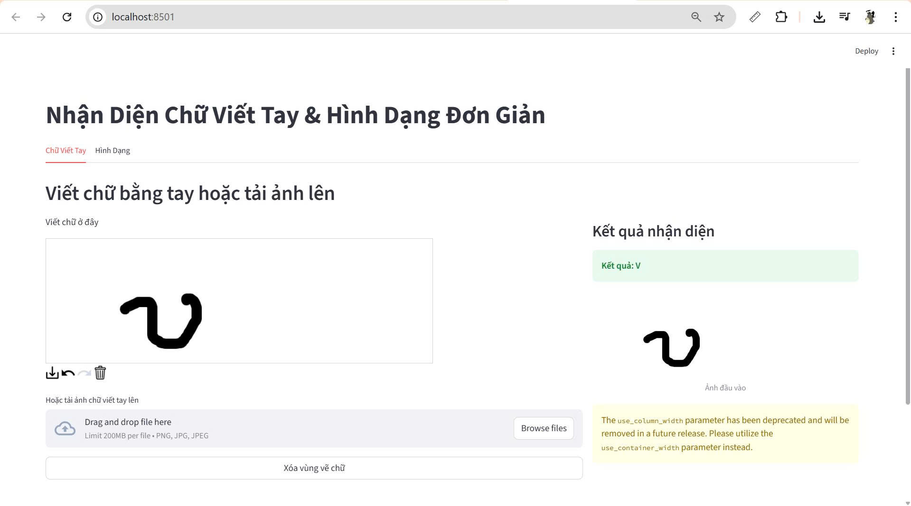
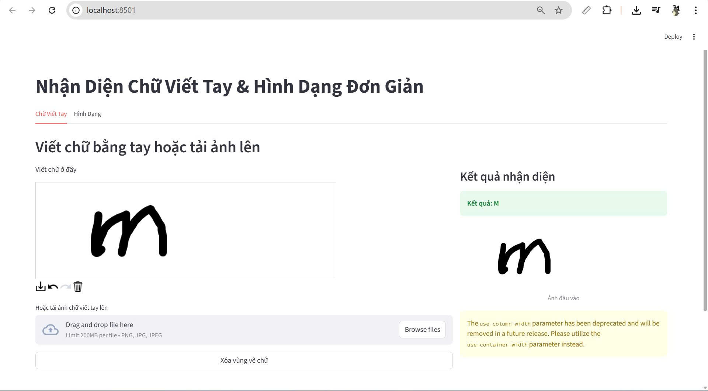
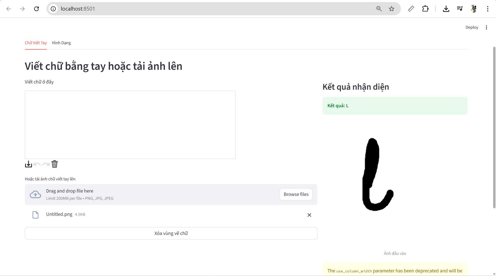
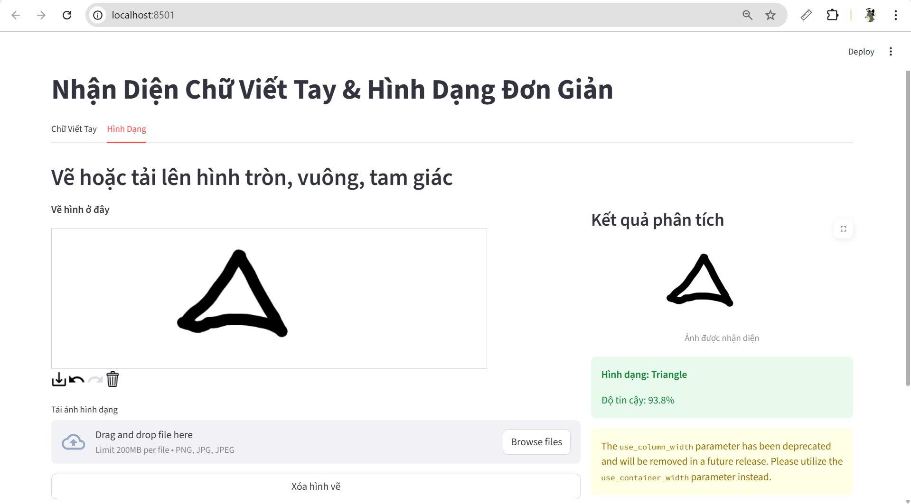
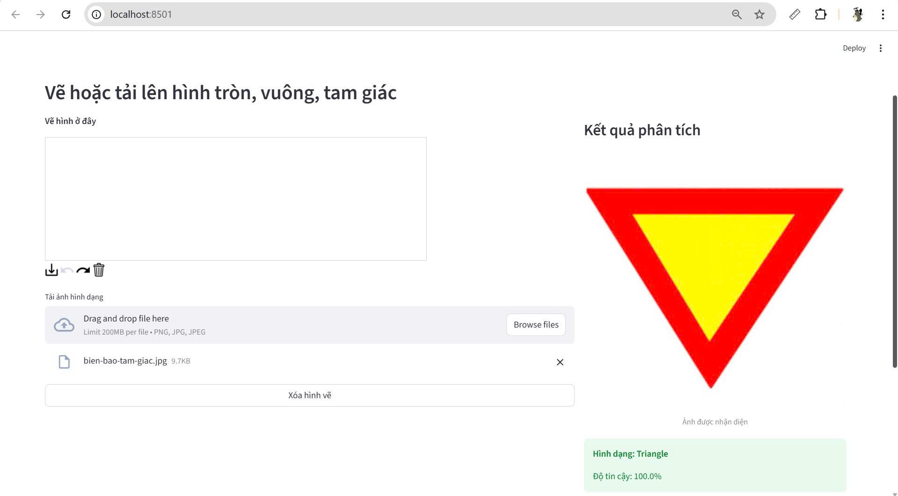

# Nhận dạng chữ viết và hình dạng đơn giản bằng mạng neural

Web app cho phép:
- **Vẽ chữ viết tay hoặc tải lên** chữ cái → nhận diện chữ cái(tiếng Anh + một số ký tự đặc biệt)
- **Vẽ hoặc tải lên** hình tròn, vuông, tam giác → dự đoán chính xác loại hình

Toàn bộ được xây dựng bằng **Python + Streamlit + TensorFlow/Keras**.

Model được train trên kaggle vì dữ liệu sẵn, xử lý dữ liệu lớn mà không phải tải xuống, tận dụng GPU được cấp miễn phí.

## Nguồn dữ liệu sử dụng

### 1. Nhận diện chữ viết tay (Tab “Chữ Viết Tay”)

- **Dataset chính**:  
  [Handwriting Recognition](https://www.kaggle.com/datasets/landlord/handwriting-recognition)  
  (cũng được biết đến với tên IAM Handwriting Database – phiên bản mở rộng trên Kaggle)

- **Thông tin chi tiết**:
  - Gồm hơn **340.000 ảnh chữ viết tay** (cắt theo từng từ) của hơn 650 người viết.
  - Nội dung: các câu tiếng Anh được trích từ tập Lancaster-Oslo/Bergen (LOB) Corpus.
  - Nhãn: file `written_name_train_v2.csv`, `written_name_validation_v2.csv`, `written_name_test_v2.csv`.
  - Kích thước ảnh: đa dạng, chủ yếu nằm ngang (width > height).
  - Được xử lý lại trong notebook `xla-chuviet.ipynb`:
    - Resize + pad về 256×64
    - Xoay 90° để đưa về shape (256, 64, 1) như yêu cầu của CRNN
    - Bộ ký tự: A–Z + dấu gạch ngang (-) và dấu nháy đơn (')
  - Model đạt **~87% accuracy** trên tập test (character-level).

### 2. Nhận diện hình dạng đơn giản (Tab “Hình Dạng”)

- **Dataset chính**:  
  [Geometric Shapes Dataset](https://www.kaggle.com/datasets/dineshpiyasamara/geometric-shapes-dataset)

- **Thông tin chi tiết**:
  - Tổng cộng **30.000 ảnh** (10.000 ảnh mỗi lớp):
    - Circle (hình tròn)
    - Square (hình vuông)
    - Triangle (hình tam giác)
  - Ảnh được vẽ thủ công hoặc sinh tự động, có độ dày nét và vị trí khác nhau.
  - Kích thước gốc: đa dạng → được resize về **128×128×3** khi train.
  - Model CNN đơn giản (4 lớp Conv + BatchNorm + Dropout) đạt **> 99.5% accuracy** trên tập test.

### Ảnh người dùng vẽ/tải lên sẽ được xử lý như sau

| Tính năng          | Ảnh chữ viết tay (Tab 1)                          | Ảnh hình dạng (Tab 2)                     |
|--------------------|----------------------------------------------------|--------------------------------------------|
| Vẽ bằng chuột      | Vùng canvas 700×220 → tự động crop + resize + xoay 90° → 256×64×1 | Vùng canvas 320×320 → resize về 128×128×3 |
| Tải ảnh lên        | Hỗ trợ PNG/JPG/JPEG → tự động crop vùng có chữ → xử lý giống trên | Hỗ trợ PNG/JPG/JPEG → resize về 128×128×3 |
| Model nhận diện    | CRNN + CTC Loss                                    | CNN 4 lớp                                 |
| Kết quả hiển thị   | Văn bản dự đoán (A–Z, -, ')                        | Circle / Square / Triangle + độ tin cậy   |

Tất cả ảnh người dùng nhập vào đều được xử lý **real-time**, không lưu trữ.


## Các tính năng chính
- Vùng vẽ rộng rãi, thoải mái (700×220 cho chữ, 320×320 cho hình)
- Tự động crop vùng có chữ (không cần viết vừa khung)
- Hỗ trợ tải ảnh lên (PNG, JPG, JPEG)
- Giao diện chia 2 cột: bên trái vẽ/tải ảnh – bên phải hiện kết quả ngay lập tức
- Nút “Xóa vùng vẽ” tiện lợi
- Hoạt động 100% offline sau khi tải model

## Yêu cầu
- Python 3.8 – 3.11
- GPU không bắt buộc (chạy được trên CPU)

## Cài đặt & chạy nhanh 

```bash
# 1. Clone hoặc tải thư mục dự án về
git clone https://github.com/Vankheeng/XuLyAnh.git
cd XuLyAnh

# 2. Tạo môi trường ảo (khuyên dùng)
python -m venv venv
venv\Scripts\activate    # Windows
# source venv/bin/activate  # Linux/Mac

# 3. Cài thư viện
pip install streamlit streamlit-drawable-canvas tensorflow opencv-python pillow numpy

# 4. Chạy app
streamlit run app.py
``` 

## Sơ đồ thư mục 

```
source/
│
├── app.py                              ← File chạy web app chính (Streamlit)
├── README.md                           ← Hướng dẫn chi tiết (đã có)
├── requirements.txt                    ← Danh sách thư viện cần cài
│
├── models/                             ← Thư mục chứa 2 file model
│   ├── handwriting_model.h5            ← Model nhận diện chữ viết tay (CRNN)
│   └── shape_detector_3classes.h5      ← Model nhận diện hình dạng (CNN)
│
├── xla-chuviet.ipynb               ← Notebook train model chữ viết tay
├── xla-hinhdang.ipynb              ← Notebook train model hình dạng
│
├── results/                            ← Ảnh demo kết quả 
│   ├── handwriting/
│   │   ├── draw/
│   │   │   ├── z7273981187482_...jpg
│   │   │   ├── z7273994379125_...jpg
│   │   │   └── ... (các ảnh vẽ tay)
│   │   └── upload_images/
│   │       ├── z727470307616_...jpg
│   │       └── ... (các ảnh tải lên)
│   │
│   └── shape/
│       ├── draw/
│       │   ├── z7276007957680_...jpg   ← Hình tròn vẽ tay
│       │   ├── z7276058011642_...jpg   ← Hình vuông
│       │   └── z7276076643382_...jpg   ← Hình tam giác
│       └── upload_images/
│           └── z7276067976282_...jpg
│
│
├── venv/                               ← Thư mục môi trường ảo (có thể bỏ qua trên GitHub)
├── .gitignore
└── gitignore                          ← File .gitignore (nếu chưa có)
```

## Kết quả
### Nhận diện chữ viết
#### Hình vẽ bằng chuột




#### Hình vẽ up lên



### Nhận diện hình dạng
#### Hình vẽ bằng chuột



#### Hình vẽ up lên





